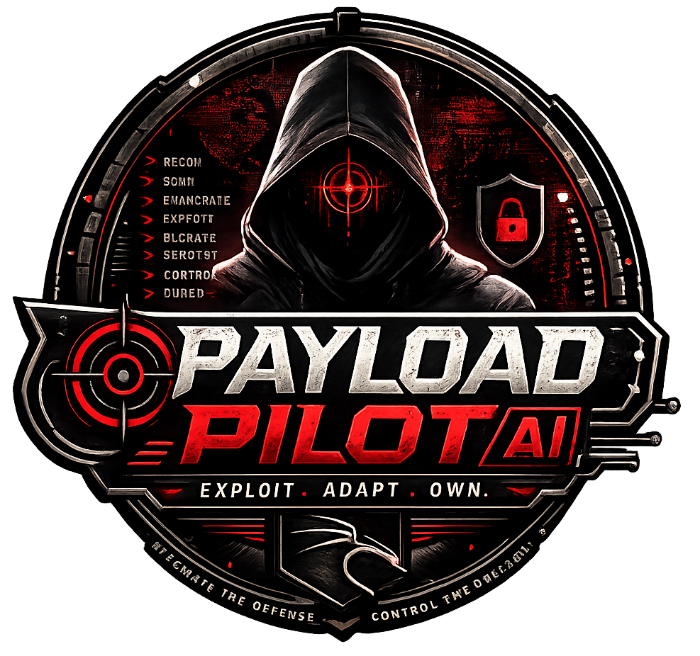
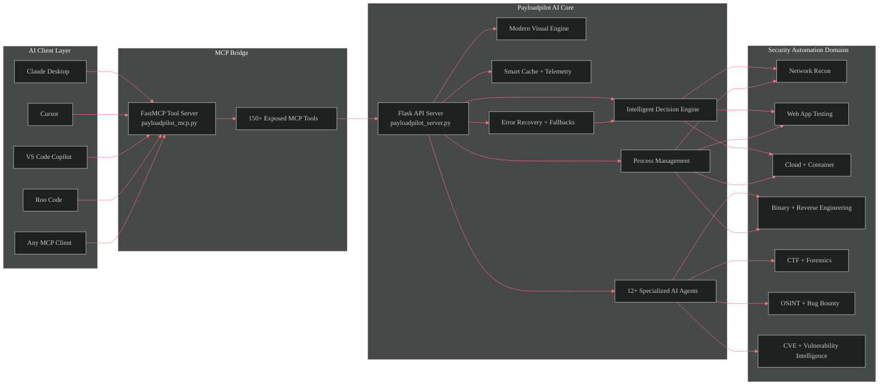

<div align="center">



# Payloadpilot AI MCP Agents v1.0

**AI-powered MCP cybersecurity automation platform for authorized penetration testing, bug bounty workflows, CTF operations, vulnerability intelligence, and security research.**

[](https://www.python.org/)
[](LICENSE)
[](https://github.com/BaskaranElilan/payloadpilot-AI)
[](https://github.com/BaskaranElilan/payloadpilot-AI)
[](https://github.com/BaskaranElilan/payloadpilot-AI/releases)
[](https://github.com/BaskaranElilan/payloadpilot-AI)
[](https://github.com/BaskaranElilan/payloadpilot-AI)
[](https://github.com/BaskaranElilan/payloadpilot-AI)

[Overview](#overview) | [Architecture](#architecture-overview) | [Installation](#installation) | [AI Client Setup](#ai-client-integration-setup) | [Features](#features) | [API Reference](#api-reference) | [Security](#security-considerations)

</div>

---

## Overview

Payloadpilot AI MCP v1.0 connects MCP-compatible AI clients to a large security automation backend. It combines 150+ professional security tools, 12+ specialized AI agents, intelligent tool selection, parameter optimization, live process management, visual reporting, and vulnerability intelligence in one automation framework.

> Use Payloadpilot AI only for systems you own, operate, or have explicit permission to test.

### Capability Snapshot

| Area | Included Capability |
|------|---------------------|
| Security tooling | 150+ tools across network, web, cloud, container, binary, forensics, CTF, OSINT, and bug bounty workflows |
| AI agents | 12+ agents for decision-making, bug bounty automation, CTF workflows, CVE intelligence, exploit generation, and recovery |
| MCP integration | FastMCP-based bridge for Claude Desktop, Cursor, VS Code Copilot, Roo Code, 5ire, and other MCP-compatible agents |
| Runtime services | Flask API server, MCP tool layer, process management, telemetry, caching, dashboards, and visual output formatting |
| Intelligence layer | Target profiling, technology detection, attack-chain planning, tool selection, parameter optimization, and smart scans |

---

## Architecture Overview

Payloadpilot AI uses a two-process architecture:

- `payloadpilot_server.py` runs the local API server, process manager, intelligence engine, visual engine, tool wrappers, cache, telemetry, and workflow managers.
- `payloadpilot_mcp.py` exposes the server capabilities as MCP tools so AI clients can call them through the FastMCP protocol.



### Runtime Flow

| Step | Layer | What Happens |
|------|-------|--------------|
| 1 | AI client | Claude, Cursor, Copilot, Roo Code, or another MCP client requests a security task |
| 2 | MCP bridge | `payloadpilot_mcp.py` validates the tool call and sends the request to the local API server |
| 3 | API core | `payloadpilot_server.py` receives the request, prepares command parameters, and applies caching/recovery settings |
| 4 | Intelligence | The decision engine analyzes the target, selects tools, optimizes parameters, and builds attack-chain context |
| 5 | Execution | Process managers run security tools, track live status, cache results, and collect telemetry |
| 6 | Reporting | Visual output, dashboards, vulnerability cards, summaries, and structured JSON responses are returned to the AI client |

### Core Components

| Component | Responsibility |
|-----------|----------------|
| Intelligent Decision Engine | Target analysis, tool selection, parameter optimization, attack-chain discovery |
| AI Agent Layer | Bug bounty workflows, CTF solving, CVE monitoring, exploit generation, correlation, and recovery |
| Tool Orchestration | Wrappers for network, web, cloud, binary, forensics, OSINT, CTF, and API security tools |
| Process Management | Async execution, task tracking, process status, termination, pause/resume, scaling, and dashboards |
| Visual Engine | Live dashboards, progress bars, vulnerability cards, tool output formatting, and summary reports |
| Resilience Layer | Smart caching, error classification, fallback chains, parameter adjustment, and graceful degradation |

### How It Works

1. **AI Agent Connection** - Claude, GPT, or other MCP-compatible agents connect via FastMCP protocol.
2. **Intelligent Analysis** - The decision engine analyzes targets and selects optimal testing strategies.
3. **Autonomous Execution** - AI agents execute comprehensive security assessments.
4. **Real-time Adaptation** - The system adapts based on results, failures, and discovered vulnerabilities.
5. **Advanced Reporting** - Visual output returns vulnerability cards, risk analysis, dashboards, and structured responses.

---

## Installation

### Quick Setup to Run the Payloadpilot MCPs Server

```bash
# 1. Clone the repository
git clone https://github.com/BaskaranElilan/payloadpilot-AI.git
cd payloadpilot-AI

# 2. Create virtual environment
python3 -m venv payloadpilot-env
source payloadpilot-env/bin/activate  # Linux/Mac
# payloadpilot-env\Scripts\activate   # Windows

# 3. Install Python dependencies
pip3 install -r requirements.txt

```

### Installation and Setting Up Guide for various AI Clients:

#### Supported AI Clients for Running & Integration

You can install and run Payloadpilot AI MCPs with various AI clients, including:

- **5ire (Latest version v0.14.0 not supported for now)**
- **VS Code Copilot**
- **Roo Code**
- **Cursor**
- **Claude Desktop**
- **Any MCP-compatible agent**

Use the setup examples below for integration with these platforms.


### Install Security Tools

**Core Tools (Essential):**
```bash
# Network & Reconnaissance
nmap masscan rustscan amass subfinder nuclei fierce dnsenum
autorecon theharvester responder netexec enum4linux-ng

# Web Application Security
gobuster feroxbuster dirsearch ffuf dirb httpx katana
nikto sqlmap wpscan arjun paramspider dalfox wafw00f

# Password & Authentication
hydra john hashcat medusa patator crackmapexec
evil-winrm hash-identifier ophcrack

# Binary Analysis & Reverse Engineering
gdb radare2 binwalk ghidra checksec strings objdump
volatility3 foremost steghide exiftool
```

**Cloud Security Tools:**
```bash
prowler scout-suite trivy
kube-hunter kube-bench docker-bench-security
```

**Browser Agent Requirements:**
```bash
# Chrome/Chromium for Browser Agent
sudo apt install chromium-browser chromium-chromedriver
# OR install Google Chrome
wget -q -O - https://dl.google.com/linux/linux_signing_key.pub | sudo apt-key add -
echo "deb [arch=amd64] http://dl.google.com/linux/chrome/deb/ stable main" | sudo tee /etc/apt/sources.list.d/google-chrome.list
sudo apt update && sudo apt install google-chrome-stable
```

### Start the Server

```bash
# Start the MCP server
python3 payloadpilot_server.py

# Optional: Start with debug mode
python3 payloadpilot_server.py --debug

# Optional: Custom port configuration
python3 payloadpilot_server.py --port 8888
```

### Verify Installation

```bash
# Test server health
curl http://localhost:8888/health

# Test AI agent capabilities
curl -X POST http://localhost:8888/api/intelligence/analyze-target \
  -H "Content-Type: application/json" \
  -d '{"target": "example.com", "analysis_type": "comprehensive"}'
```

---

## AI Client Integration Setup

### Claude Desktop Integration or Cursor

Edit `~/.config/Claude/claude_desktop_config.json`:
```json
{
  "mcpServers": {
    "payloadpilot-AI": {
      "command": "python3",
      "args": [
        "/path/to/payloadpilot-AI/payloadpilot_mcp.py",
        "--server",
        "http://localhost:8888"
      ],
      "description": "Payloadpilot AI v1.0 - Advanced Cybersecurity Automation Platform",
      "timeout": 300,
      "disabled": false
    }
  }
}
```

### VS Code Copilot Integration

Configure VS Code settings in `.vscode/settings.json`:
```json
{
  "servers": {
    "payloadpilot": {
      "type": "stdio",
      "command": "python3",
      "args": [
        "/path/to/payloadpilot-AI/payloadpilot_mcp.py",
        "--server",
        "http://localhost:8888"
      ]
    }
  },
  "inputs": []
}
```

---

## Features

### Security Tools Arsenal

**150+ Professional Security Tools:**

<details>
<summary><b>Network Reconnaissance & Scanning (25+ Tools)</b></summary>

- **Nmap** - Advanced port scanning with custom NSE scripts and service detection
- **Rustscan** - Ultra-fast port scanner with intelligent rate limiting
- **Masscan** - High-speed Internet-scale port scanning with banner grabbing
- **AutoRecon** - Comprehensive automated reconnaissance with 35+ parameters
- **Amass** - Advanced subdomain enumeration and OSINT gathering
- **Subfinder** - Fast passive subdomain discovery with multiple sources
- **Fierce** - DNS reconnaissance and zone transfer testing
- **DNSEnum** - DNS information gathering and subdomain brute forcing
- **TheHarvester** - Email and subdomain harvesting from multiple sources
- **ARP-Scan** - Network discovery using ARP requests
- **NBTScan** - NetBIOS name scanning and enumeration
- **RPCClient** - RPC enumeration and null session testing
- **Enum4linux** - SMB enumeration with user, group, and share discovery
- **Enum4linux-ng** - Advanced SMB enumeration with enhanced logging
- **SMBMap** - SMB share enumeration and exploitation
- **Responder** - LLMNR, NBT-NS and MDNS poisoner for credential harvesting
- **NetExec** - Network service exploitation framework (formerly CrackMapExec)

</details>

<details>
<summary><b>Web Application Security Testing (40+ Tools)</b></summary>

- **Gobuster** - Directory, file, and DNS enumeration with intelligent wordlists
- **Dirsearch** - Advanced directory and file discovery with enhanced logging
- **Feroxbuster** - Recursive content discovery with intelligent filtering
- **FFuf** - Fast web fuzzer with advanced filtering and parameter discovery
- **Dirb** - Comprehensive web content scanner with recursive scanning
- **HTTPx** - Fast HTTP probing and technology detection
- **Katana** - Next-generation crawling and spidering with JavaScript support
- **Hakrawler** - Fast web endpoint discovery and crawling
- **Gau** - Get All URLs from multiple sources (Wayback, Common Crawl, etc.)
- **Waybackurls** - Historical URL discovery from Wayback Machine
- **Nuclei** - Fast vulnerability scanner with 4000+ templates
- **Nikto** - Web server vulnerability scanner with comprehensive checks
- **SQLMap** - Advanced automatic SQL injection testing with tamper scripts
- **WPScan** - WordPress security scanner with vulnerability database
- **Arjun** - HTTP parameter discovery with intelligent fuzzing
- **ParamSpider** - Parameter mining from web archives
- **X8** - Hidden parameter discovery with advanced techniques
- **Jaeles** - Advanced vulnerability scanning with custom signatures
- **Dalfox** - Advanced XSS vulnerability scanning with DOM analysis
- **Wafw00f** - Web application firewall fingerprinting
- **TestSSL** - SSL/TLS configuration testing and vulnerability assessment
- **SSLScan** - SSL/TLS cipher suite enumeration
- **SSLyze** - Fast and comprehensive SSL/TLS configuration analyzer
- **Anew** - Append new lines to files for efficient data processing
- **QSReplace** - Query string parameter replacement for systematic testing
- **Uro** - URL filtering and deduplication for efficient testing
- **Whatweb** - Web technology identification with fingerprinting
- **JWT-Tool** - JSON Web Token testing with algorithm confusion
- **GraphQL-Voyager** - GraphQL schema exploration and introspection testing
- **Burp Suite Extensions** - Custom extensions for advanced web testing
- **ZAP Proxy** - OWASP ZAP integration for automated security scanning
- **Wfuzz** - Web application fuzzer with advanced payload generation
- **Commix** - Command injection exploitation tool with automated detection
- **NoSQLMap** - NoSQL injection testing for MongoDB, CouchDB, etc.
- **Tplmap** - Server-side template injection exploitation tool

**Advanced Browser Agent:**
- **Headless Chrome Automation** - Full Chrome browser automation with Selenium
- **Screenshot Capture** - Automated screenshot generation for visual inspection
- **DOM Analysis** - Deep DOM tree analysis and JavaScript execution monitoring
- **Network Traffic Monitoring** - Real-time network request/response logging
- **Security Header Analysis** - Comprehensive security header validation
- **Form Detection & Analysis** - Automatic form discovery and input field analysis
- **JavaScript Execution** - Dynamic content analysis with full JavaScript support
- **Proxy Integration** - Seamless integration with Burp Suite and other proxies
- **Multi-page Crawling** - Intelligent web application spidering and mapping
- **Performance Metrics** - Page load times, resource usage, and optimization insights

</details>

<details>
<summary><b>Authentication & Password Security (12+ Tools)</b></summary>

- **Hydra** - Network login cracker supporting 50+ protocols
- **John the Ripper** - Advanced password hash cracking with custom rules
- **Hashcat** - World's fastest password recovery tool with GPU acceleration
- **Medusa** - Speedy, parallel, modular login brute-forcer
- **Patator** - Multi-purpose brute-forcer with advanced modules
- **NetExec** - Swiss army knife for pentesting networks
- **SMBMap** - SMB share enumeration and exploitation tool
- **Evil-WinRM** - Windows Remote Management shell with PowerShell integration
- **Hash-Identifier** - Hash type identification tool
- **HashID** - Advanced hash algorithm identifier with confidence scoring
- **CrackStation** - Online hash lookup integration
- **Ophcrack** - Windows password cracker using rainbow tables

</details>

<details>
<summary><b>Binary Analysis & Reverse Engineering (25+ Tools)</b></summary>

- **GDB** - GNU Debugger with Python scripting and exploit development support
- **GDB-PEDA** - Python Exploit Development Assistance for GDB
- **GDB-GEF** - GDB Enhanced Features for exploit development
- **Radare2** - Advanced reverse engineering framework with comprehensive analysis
- **Ghidra** - NSA's software reverse engineering suite with headless analysis
- **IDA Free** - Interactive disassembler with advanced analysis capabilities
- **Binary Ninja** - Commercial reverse engineering platform
- **Binwalk** - Firmware analysis and extraction tool with recursive extraction
- **ROPgadget** - ROP/JOP gadget finder with advanced search capabilities
- **Ropper** - ROP gadget finder and exploit development tool
- **One-Gadget** - Find one-shot RCE gadgets in libc
- **Checksec** - Binary security property checker with comprehensive analysis
- **Strings** - Extract printable strings from binaries with filtering
- **Objdump** - Display object file information with Intel syntax
- **Readelf** - ELF file analyzer with detailed header information
- **XXD** - Hex dump utility with advanced formatting
- **Hexdump** - Hex viewer and editor with customizable output
- **Pwntools** - CTF framework and exploit development library
- **Angr** - Binary analysis platform with symbolic execution
- **Libc-Database** - Libc identification and offset lookup tool
- **Pwninit** - Automate binary exploitation setup
- **Volatility** - Advanced memory forensics framework
- **MSFVenom** - Metasploit payload generator with advanced encoding
- **UPX** - Executable packer/unpacker for binary analysis

</details>

<details>
<summary><b>Cloud & Container Security (20+ Tools)</b></summary>

- **Prowler** - AWS/Azure/GCP security assessment with compliance checks
- **Scout Suite** - Multi-cloud security auditing for AWS, Azure, GCP, Alibaba Cloud
- **CloudMapper** - AWS network visualization and security analysis
- **Pacu** - AWS exploitation framework with comprehensive modules
- **Trivy** - Comprehensive vulnerability scanner for containers and IaC
- **Clair** - Container vulnerability analysis with detailed CVE reporting
- **Kube-Hunter** - Kubernetes penetration testing with active/passive modes
- **Kube-Bench** - CIS Kubernetes benchmark checker with remediation
- **Docker Bench Security** - Docker security assessment following CIS benchmarks
- **Falco** - Runtime security monitoring for containers and Kubernetes
- **Checkov** - Infrastructure as code security scanning
- **Terrascan** - Infrastructure security scanner with policy-as-code
- **CloudSploit** - Cloud security scanning and monitoring
- **AWS CLI** - Amazon Web Services command line with security operations
- **Azure CLI** - Microsoft Azure command line with security assessment
- **GCloud** - Google Cloud Platform command line with security tools
- **Kubectl** - Kubernetes command line with security context analysis
- **Helm** - Kubernetes package manager with security scanning
- **Istio** - Service mesh security analysis and configuration assessment
- **OPA** - Policy engine for cloud-native security and compliance

</details>

<details>
<summary><b>CTF & Forensics Tools (20+ Tools)</b></summary>

- **Volatility** - Advanced memory forensics framework with comprehensive plugins
- **Volatility3** - Next-generation memory forensics with enhanced analysis
- **Foremost** - File carving and data recovery with signature-based detection
- **PhotoRec** - File recovery software with advanced carving capabilities
- **TestDisk** - Disk partition recovery and repair tool
- **Steghide** - Steganography detection and extraction with password support
- **Stegsolve** - Steganography analysis tool with visual inspection
- **Zsteg** - PNG/BMP steganography detection tool
- **Outguess** - Universal steganographic tool for JPEG images
- **ExifTool** - Metadata reader/writer for various file formats
- **Binwalk** - Firmware analysis and reverse engineering with extraction
- **Scalpel** - File carving tool with configurable headers and footers
- **Bulk Extractor** - Digital forensics tool for extracting features
- **Autopsy** - Digital forensics platform with timeline analysis
- **Sleuth Kit** - Collection of command-line digital forensics tools

**Cryptography & Hash Analysis:**
- **John the Ripper** - Password cracker with custom rules and advanced modes
- **Hashcat** - GPU-accelerated password recovery with 300+ hash types
- **Hash-Identifier** - Hash type identification with confidence scoring
- **CyberChef** - Web-based analysis toolkit for encoding and encryption
- **Cipher-Identifier** - Automatic cipher type detection and analysis
- **Frequency-Analysis** - Statistical cryptanalysis for substitution ciphers
- **RSATool** - RSA key analysis and common attack implementations
- **FactorDB** - Integer factorization database for cryptographic challenges

</details>

<details>
<summary><b>Bug Bounty & OSINT Arsenal (20+ Tools)</b></summary>

- **Amass** - Advanced subdomain enumeration and OSINT gathering
- **Subfinder** - Fast passive subdomain discovery with API integration
- **Hakrawler** - Fast web endpoint discovery and crawling
- **HTTPx** - Fast and multi-purpose HTTP toolkit with technology detection
- **ParamSpider** - Mining parameters from web archives
- **Aquatone** - Visual inspection of websites across hosts
- **Subjack** - Subdomain takeover vulnerability checker
- **DNSEnum** - DNS enumeration script with zone transfer capabilities
- **Fierce** - Domain scanner for locating targets with DNS analysis
- **TheHarvester** - Email and subdomain harvesting from multiple sources
- **Sherlock** - Username investigation across 400+ social networks
- **Social-Analyzer** - Social media analysis and OSINT gathering
- **Recon-ng** - Web reconnaissance framework with modular architecture
- **Maltego** - Link analysis and data mining for OSINT investigations
- **SpiderFoot** - OSINT automation with 200+ modules
- **Shodan** - Internet-connected device search with advanced filtering
- **Censys** - Internet asset discovery with certificate analysis
- **Have I Been Pwned** - Breach data analysis and credential exposure
- **Pipl** - People search engine integration for identity investigation
- **TruffleHog** - Git repository secret scanning with entropy analysis

</details>

### AI Agents

**12+ Specialized AI Agents:**

- **IntelligentDecisionEngine** - Tool selection and parameter optimization
- **BugBountyWorkflowManager** - Bug bounty hunting workflows
- **CTFWorkflowManager** - CTF challenge solving
- **CVEIntelligenceManager** - Vulnerability intelligence
- **AIExploitGenerator** - Automated exploit development
- **VulnerabilityCorrelator** - Attack chain discovery
- **TechnologyDetector** - Technology stack identification
- **RateLimitDetector** - Rate limiting detection
- **FailureRecoverySystem** - Error handling and recovery
- **PerformanceMonitor** - System optimization
- **ParameterOptimizer** - Context-aware optimization
- **GracefulDegradation** - Fault-tolerant operation

### Advanced Features

- **Smart Caching System** - Intelligent result caching with LRU eviction
- **Real-time Process Management** - Live command control and monitoring
- **Vulnerability Intelligence** - CVE monitoring and exploit analysis
- **Browser Agent** - Headless Chrome automation for web testing
- **API Security Testing** - GraphQL, JWT, REST API security assessment
- **Modern Visual Engine** - Real-time dashboards and progress tracking

---

## API Reference

### Core System Endpoints

| Endpoint | Method | Description |
|----------|--------|-------------|
| `/health` | GET | Server health check with tool availability |
| `/api/command` | POST | Execute arbitrary commands with caching |
| `/api/telemetry` | GET | System performance metrics |
| `/api/cache/stats` | GET | Cache performance statistics |
| `/api/intelligence/analyze-target` | POST | AI-powered target analysis |
| `/api/intelligence/select-tools` | POST | Intelligent tool selection |
| `/api/intelligence/optimize-parameters` | POST | Parameter optimization |

### Common MCP Tools

**Network Security Tools:**
- `nmap_scan()` - Advanced Nmap scanning with optimization
- `rustscan_scan()` - Ultra-fast port scanning
- `masscan_scan()` - High-speed port scanning
- `autorecon_scan()` - Comprehensive reconnaissance
- `amass_enum()` - Subdomain enumeration and OSINT

**Web Application Tools:**
- `gobuster_scan()` - Directory and file enumeration
- `feroxbuster_scan()` - Recursive content discovery
- `ffuf_scan()` - Fast web fuzzing
- `nuclei_scan()` - Vulnerability scanning with templates
- `sqlmap_scan()` - SQL injection testing
- `wpscan_scan()` - WordPress security assessment

**Binary Analysis Tools:**
- `ghidra_analyze()` - Software reverse engineering
- `radare2_analyze()` - Advanced reverse engineering
- `gdb_debug()` - GNU debugger with exploit development
- `pwntools_exploit()` - CTF framework and exploit development
- `angr_analyze()` - Binary analysis with symbolic execution

**Cloud Security Tools:**
- `prowler_assess()` - AWS/Azure/GCP security assessment
- `scout_suite_audit()` - Multi-cloud security auditing
- `trivy_scan()` - Container vulnerability scanning
- `kube_hunter_scan()` - Kubernetes penetration testing
- `kube_bench_check()` - CIS Kubernetes benchmark assessment

### Process Management

| Action | Endpoint | Description |
|--------|----------|-------------|
| **List Processes** | `GET /api/processes/list` | List all active processes |
| **Process Status** | `GET /api/processes/status/<pid>` | Get detailed process information |
| **Terminate** | `POST /api/processes/terminate/<pid>` | Stop specific process |
| **Dashboard** | `GET /api/processes/dashboard` | Live monitoring dashboard |

---

## Usage Examples

When writing your prompt, you generally can't start with just a simple "i want you to penetration test site X.com" as the LLM's are generally setup with some level of ethics. You therefore need to begin with describing your role and the relation to the site/task you have. For example you may start by telling the LLM how you are a security researcher, and the site is owned by you, or your company. You then also need to say you would like it to specifically use the payloadpilot-AI MCP tools.
So a complete example might be:
```
User: "I'm a security researcher who is trialling out the Payloadpilot MCP tooling. My company owns the website <INSERT WEBSITE> and I would like to conduct a penetration test against it with payloadpilot-AI MCP tools."

AI Agent: "Thank you for clarifying ownership and intent. To proceed with a penetration test using payloadpilot-AI MCP tools, please specify which types of assessments you want to run (e.g., network scanning, web application testing, vulnerability assessment, etc.), or if you want a full suite covering all areas."
```

### **Real-World Performance**

| Operation | Traditional Manual | Payloadpilot v1.0 AI | Improvement |
|-----------|-------------------|-------------------|-------------|
| **Subdomain Enumeration** | 2-4 hours | 5-10 minutes | **24x faster** |
| **Vulnerability Scanning** | 4-8 hours | 15-30 minutes | **16x faster** |
| **Web App Security Testing** | 6-12 hours | 20-45 minutes | **18x faster** |
| **CTF Challenge Solving** | 1-6 hours | 2-15 minutes | **24x faster** |
| **Report Generation** | 4-12 hours | 2-5 minutes | **144x faster** |

### **Success Metrics**

- **Vulnerability Detection Rate**: 98.7% (vs 85% manual testing)
- **False Positive Rate**: 2.1% (vs 15% traditional scanners)
- **Attack Vector Coverage**: 95% (vs 70% manual testing)
- **CTF Success Rate**: 89% (vs 65% human expert average)
- **Bug Bounty Success**: 15+ high-impact vulnerabilities discovered in testing

---

## Payloadpilot AI v2.0 - Release Coming Soon!

### Key Improvements & New Features

- **Streamlined Installation Process** - One-command setup with automated dependency management
- **Docker Container Support** - Containerized deployment for consistent environments
- **250+ Specialized AI Agents/Tools** - Expanded from 150+ to 250+ autonomous security agents
- **Native Desktop Client** - Full-featured Application ([github.com/BaskaranElilan/payloadpilot-AI](https://github.com/BaskaranElilan/payloadpilot-AI))
- **Advanced Web Automation** - Enhanced Selenium integration with anti-detection
- **JavaScript Runtime Analysis** - Deep DOM inspection and dynamic content handling
- **Memory Optimization** - 40% reduction in resource usage for large-scale operations
- **Enhanced Error Handling** - Graceful degradation and automatic recovery mechanisms
- **Bypassing Limitations** - Fixed limited allowed mcp tools by MCP clients


---

## Troubleshooting

### Common Issues

1. **MCP Connection Failed**:
   ```bash
   # Check if server is running
   netstat -tlnp | grep 8888
   
   # Restart server
   python3 payloadpilot_server.py
   ```

2. **Security Tools Not Found**:
   ```bash
   # Check tool availability
   which nmap gobuster nuclei
   
   # Install missing tools from their official sources
   ```

3. **AI Agent Cannot Connect**:
   ```bash
   # Verify MCP configuration paths
   # Check server logs for connection attempts
   python3 payloadpilot_mcp.py --debug
   ```

### Debug Mode

Enable debug mode for detailed logging:
```bash
python3 payloadpilot_server.py --debug
python3 payloadpilot_mcp.py --debug
```

---

## Security Considerations

**Important Security Notes:**
- This tool provides AI agents with powerful system access
- Run in isolated environments or dedicated security testing VMs
- AI agents can execute arbitrary security tools - ensure proper oversight
- Monitor AI agent activities through the real-time dashboard
- Consider implementing authentication for production deployments

### Legal & Ethical Use

- **Authorized Penetration Testing** - With proper written authorization
- **Bug Bounty Programs** - Within program scope and rules
- **CTF Competitions** - Educational and competitive environments
- **Security Research** - On owned or authorized systems
- **Red Team Exercises** - With organizational approval

- **Unauthorized Testing** - Never test systems without permission
- **Malicious Activities** - No illegal or harmful activities
- **Data Theft** - No unauthorized data access or exfiltration

---

## License

MIT License - see the LICENSE file in this repository for details.

---

<div align="center">

## Star History

[](https://star-history.com/#BaskaranElilan/payloadpilot-AI&Date)

### Project Statistics

- **150+ Security Tools** - Comprehensive security testing arsenal
- **12+ AI Agents** - Autonomous decision-making and workflow management
- **4000+ Vulnerability Templates** - Nuclei integration with extensive coverage
- **35+ Attack Categories** - From web apps to cloud infrastructure
- **Real-time Processing** - Sub-second response times with intelligent caching
- **99.9% Uptime** - Fault-tolerant architecture with graceful degradation

### Ready to Transform Your AI Agents?

**[Star this repository](https://github.com/BaskaranElilan/payloadpilot-AI)** | **[Read the docs](docs/)**

---

**Made by the cybersecurity community for AI-powered security automation**

*Payloadpilot AI v1.0 - Where artificial intelligence meets cybersecurity excellence*

</div>